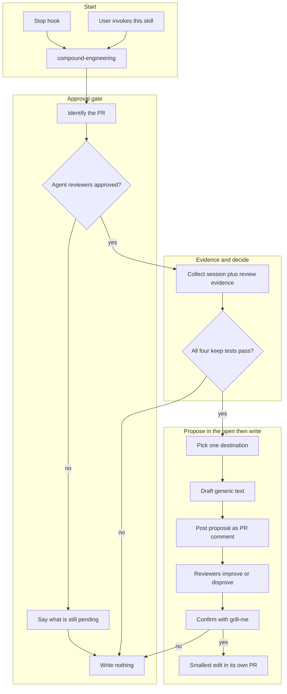

# Compound engineering (post-approval)

A **workflow** that asks whether this pull request taught the next agent anything durable. It is not a CI job. CI cannot judge whether a sentence would restrict the next agent on a different problem.

**Default is skip.** Most pull requests produce nothing. When something is worth keeping, propose **one** destination and wait for confirmation. Never write first.

**Propose in the open.** A keep is a top-level pull-request comment before any write, so reviewers can improve or disprove it. The comment is not a review: no approve, no request changes.

Do **not** run this when a pull request is opened. Reviewer comments are the evidence. Do not add this skill as a phase of `implement-agent-task` or any "open a pull request" workflow.



## When to run

- Reviewer-agent checks on the pull request have succeeded. The default marker in the hook is a check **name** containing `Cursor Approval Agent`. If this repo's reviewers publish a different name, use that name in both the hook and Phase 1. Match `name`, not `context`.
- A review bot that left a review, if one exists, approved rather than requested changes.
- The user asks to compound engineering, save a learning, or update an agents file, a rule, or a skill after review.

## When not to run

- The pull request just opened, or reviews are still pending or requesting changes.
- A human code owner has not approved. That is **not** this gate. Owner approval often waits on a person.
- The lesson is the change itself: one bug, one file, one acceptance criterion.

## Project hook

This package ships `.cursor/hooks.json` and `skills/compound-engineering/scripts/compound-engineering-stop.mjs`. Copy both into a repo that should offer the skill after reviewer agents approve. The script only decides whether to nudge. **Policy lives in this skill.** The hook fails open: missing `gh`, no pull request, bad JSON, or an unevaluable check prints `{}`. After a follow-up, load this skill and start at Phase 1. Do not skip the gate.

The hook offers at most once per pull-request head (`loop_limit: 1` plus a marker file).

## Phase 1 — Approval gate

Identify the pull request from an argument, the current branch, or a URL. Read it with `gh pr view --json number,url,title,reviews,statusCheckRollup`.

Before hard-coding a check name, list real checks:

```bash
gh pr view <number> --repo <org>/<repo> --json statusCheckRollup \
  --jq '(.statusCheckRollup // [])[] | {name, context, conclusion, state, status}'
```

**Eligible only if:**

1. Every reviewer-agent check you care about is success, and none of those checks are pending or failing. If the repo has no such checks, the hook stays quiet. A manual invoke may continue only after the user confirms the reviewers they care about have approved.
2. Any review-bot review that exists is `APPROVED`, not `CHANGES_REQUESTED`.
3. Do **not** require a human code-owner approval.

If the gate fails: stop. List what is still pending. Write nothing.

## Phase 2 — Collect evidence

From this session and the pull request (diff summary, review threads, reviewer-agent comments):

- Commands, paths, or docs the agent had to discover that the agents file, rules, or skills did not mention.
- Conventions reviewers insisted on.
- Guardrails that would have prevented a class of mistakes, not this one line.

Ignore the feature design, ticket ids, and what this pull request changed.

## Phase 3 — Decision engine

Follow `references/decision-engine.md` in this skill's `get_skill` response. Default outcome is **skip**. If skip: say so in one or two sentences and stop. Do not invent a small write to look useful.

## Phase 4 — One destination, generic draft

If keep: pick **exactly one** destination. Draft the exact markdown. Follow `references/genericness.md`. If the draft names a ticket, one function, or "always do it this way," rewrite it or skip.

## Phase 5 — Post the proposal on the pull request

On a **keep**, post one top-level comment. Follow `references/pr-comment.md`. On a **skip**, post nothing. If a comment already exists for this head, reply in that thread.

Use `gh pr comment`. Do not submit an Approve or Request Changes review.

## Phase 6 — Confirm

Call `get_skill("grill-me")`. One question. If the keep is borderline, the recommendation is skip. Include do-nothing.

Reviewer replies on the comment outrank the engine. Disputed items are dropped. Reworded items use the reviewer's words. Write only after an explicit yes.

## Phase 7 — Write

Smallest addition. Its **own** pull request. Do not push context onto the branch already under review unless the author asks.

- **Agents file** or an always-on rule: do not restructure the file.
- **New skill:** call `get_skill("create-skill")` and follow `references/composition.md`. Shared workflows go in this catalog. Repo-only workflows stay in that repo.

## References

- `get_skill("grill-me")` — Phase 6
- `get_skill("create-skill")` (`references/composition.md`) — only if Phase 7 is a new skill
- `references/decision-engine.md` — keep tests and destination routing
- `references/genericness.md` — rewrite test
- `references/pr-comment.md` — Phase 5 template
